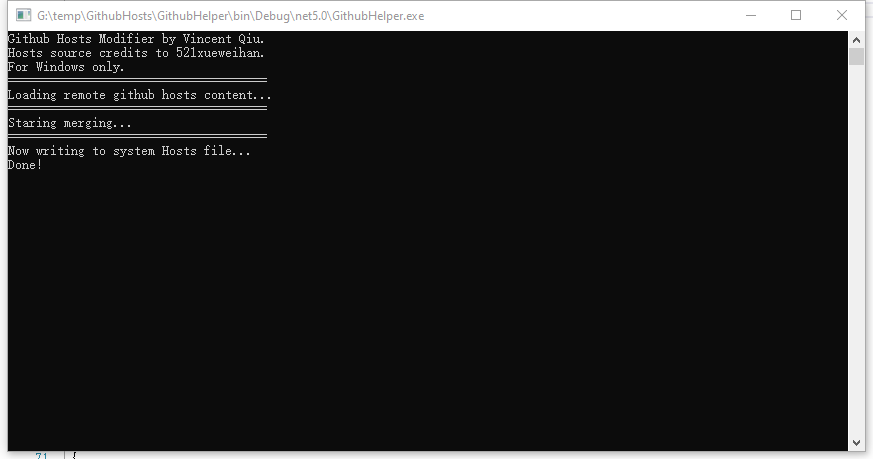

# GithubHosts
Updates the system hosts to avoid unknown issue with Github Server

## Screenshot
> Windows



> Linux


## Hosts source
Hosts source credits to 521xueweihan.

## Linux
> Linux dotnet 5.0 installation

```
wget https://dot.net/v1/dotnet-install.sh
./dotnet-install.sh -c 5.0  --runtime dotnet
```

> Run Program
```
export DOTNET_SYSTEM_GLOBALIZATION_INVARIANT=1
.dotnet/dotnet /path/to/folder/GithubHelper.dll
```